# GKE Security Agent - AI-Powered Autonomous Security Scanner

A sophisticated security agent that performs autonomous penetration testing on the Online Boutique microservices application, demonstrating AI-powered security scanning capabilities for the GKE Turns 10 Hackathon.

## 🎯 Project Overview

**Aegis Agent** is an AI-powered autonomous security scanner designed to analyze and secure the Online Boutique microservices application. It combines advanced security scanning techniques with AI-generated insights to provide comprehensive security assessments.

### Key Features

- **Autonomous Security Scanning**: Automatically discovers and analyzes 11 microservices
- **AI-Powered Analysis**: Uses Google Gemini to generate intelligent security summaries
- **Real-time Monitoring**: Continuous security assessment with live status updates
- **Professional UI**: Dark-themed security tool interface with severity-based color coding
- **Cloud-Native Architecture**: Deployed on Google Cloud Run with GKE integration

## 🏗️ Architecture

```mermaid
graph BT
    %% User and External Components
    U[👤 Security Analyst]
    OB[🌐 Online Boutique<br/>Target Application]
    
    %% Frontend Layer
    F[🖥️ Next.js Frontend<br/>Professional Dashboard]
    
    %% Backend Services
    B[⚡ FastAPI Backend<br/>Security Scanner + LangGraph Agent]
    
    %% Target Microservices (GKE)
    subgraph GKE[☸️ Google Kubernetes Engine]
        subgraph Microservices[🏪 Online Boutique Microservices]
            FE[Frontend Service]
            CS[Cart Service]
            PCS[Product Catalog Service]
            CUS[Currency Service]
            PS[Payment Service]
            SS[Shipping Service]
            ES[Email Service]
            COS[Checkout Service]
            RS[Recommendation Service]
            AS[Ad Service]
            LG[Load Generator]
        end
    end
    
    %% Google Cloud Services
    subgraph GCP[☁️ Google Cloud Platform]
        subgraph CloudRun[🚀 Cloud Run]
            F
            B
        end
        
        subgraph DataServices[💾 Data & AI Services]
            FS[🔥 Firestore<br/>Scan Results Storage]
            VAI[🤖 Vertex AI<br/>Gemini Model]
        end
        
        subgraph Infrastructure[🏗️ Infrastructure]
            AR[📦 Artifact Registry<br/>Container Images]
            CB[🔨 Cloud Build<br/>CI/CD Pipeline]
        end
    end
    
    %% Security Scanning Flow
    U -->|1. Start Security Scan| F
    F -->|2. Scan Request| B
    B -->|3. Autonomous Penetration Testing| OB
    OB -->|4. Service Discovery & Vulnerability Detection| B
    
    %% Data Storage and AI Analysis
    B -->|5. Store Findings| FS
    B -->|6. Generate AI Summary| VAI
    VAI -->|7. AI Analysis Results| B
    B -->|8. Return Results| F
    F -->|9. Display Security Report| U
    
    %% Target Application Access
    B -.->|HTTP/gRPC Scanning| FE
    B -.->|Service Analysis| CS
    B -.->|API Testing| PCS
    B -.->|Security Headers Check| CUS
    B -.->|Endpoint Discovery| PS
    B -.->|Configuration Analysis| SS
    B -.->|Vulnerability Detection| ES
    B -.->|gRPC Service Mapping| COS
    B -.->|Security Assessment| RS
    B -.->|Service Communication| AS
    B -.->|Load Testing| LG
    
    %% Deployment Pipeline
    AR -->|Container Images| CloudRun
    CB -->|Deploy| CloudRun
    
    %% Styling
    classDef frontend fill:#007BFF,stroke:#0056b3,stroke-width:2px,color:#fff
    classDef backend fill:#28A745,stroke:#1e7e34,stroke-width:2px,color:#fff
    classDef microservice fill:#FFC107,stroke:#e0a800,stroke-width:2px,color:#000
    classDef gcp fill:#4285F4,stroke:#3367d6,stroke-width:2px,color:#fff
    classDef data fill:#9C27B0,stroke:#7b1fa2,stroke-width:2px,color:#fff
    classDef user fill:#6C757D,stroke:#545b62,stroke-width:2px,color:#fff
    
    class F frontend
    class B backend
    class FE,CS,PCS,CUS,PS,SS,ES,COS,RS,AS,LG microservice
    class GCP,CloudRun,Infrastructure gcp
    class FS,VAI data
    class U user
```



### Technology Stack

- **Backend**: FastAPI (Python) with LangGraph agent logic
- **Frontend**: Next.js/React with professional dark theme
- **Cloud Platform**: Google Cloud Run + GKE
- **AI Model**: Google Gemini via Vertex AI API
- **Database**: Firestore for scan results storage
- **Container Registry**: Google Artifact Registry

## 🚀 Quick Start

### Prerequisites

- Google Cloud Project with billing enabled
- `gcloud` CLI installed and authenticated
- `kubectl` installed
- `docker` installed
- Google Gemini API key (get from [Google AI Studio](https://makersuite.google.com/app/apikey))

### 1. Deploy Online Boutique to GKE

```bash
# Set your project ID
export PROJECT_ID=your-project-id

# Run the setup script
chmod +x scripts/setup-gcp.sh
./scripts/setup-gcp.sh
```

This will:
- Create a GKE Autopilot cluster
- Deploy Online Boutique with all 11 microservices
- Provide you with the external IP for scanning

### 2. Deploy Security Agent

```bash
# Set your Gemini API key
export GEMINI_API_KEY=your_gemini_api_key_here

# Deploy to Cloud Run
chmod +x scripts/deploy.sh
./scripts/deploy.sh
```

This will:
- Build and push container images
- Deploy FastAPI backend to Cloud Run
- Deploy Next.js frontend to Cloud Run
- Provide you with the frontend URL

### 3. Start Scanning

1. Open the frontend URL in your browser
2. Enter the Online Boutique external IP
3. Click "Start Security Scan"
4. View results and generate AI summary

## 🔧 Manual Setup

### Local Development

```bash
# Set up environment variables
cp backend/.env.example backend/.env
# Edit backend/.env and add your GEMINI_API_KEY

# Run both backend and frontend locally
chmod +x scripts/run-local.sh
./scripts/run-local.sh
```

### Individual Service Development

```bash
# Backend only
cd backend
pip install -r requirements.txt
python main.py

# Frontend only
cd frontend
npm install
npm run dev
```

## 📊 Security Scanning Capabilities

### Microservice Discovery
- Automatically discovers all 11 Online Boutique microservices
- Maps service communication patterns
- Identifies gRPC service definitions

### Vulnerability Detection
- **HTTP Security Headers**: CSP, HSTS, X-Frame-Options, etc.
- **Information Disclosure**: Server information, debug endpoints
- **Configuration Issues**: Insecure HTTP, exposed admin endpoints
- **Service Security**: gRPC service security configurations

### AI-Powered Analysis
- Generates human-readable security summaries
- Provides business impact assessments
- Offers actionable remediation recommendations
- Explains technical findings in plain English

## 🎨 UI/UX Features

### Professional Dark Theme
- Security tool aesthetic with dark mode
- Severity-based color coding (Critical, High, Medium, Low)
- Responsive design for all screen sizes
- Smooth animations and transitions

### Interactive Components
- Real-time scan status updates
- Expandable vulnerability details
- AI summary generation
- Professional vulnerability cards

## 📁 Project Structure

```
gke-security-agent/
├── backend/                     # FastAPI service
│   ├── main.py                 # FastAPI app + LangGraph agent
│   ├── scanner.py              # Security scanning logic
│   ├── requirements.txt
│   └── Dockerfile
├── frontend/                   # Next.js dashboard
│   ├── src/app/
│   │   ├── page.tsx           # Main dashboard
│   │   └── globals.css        # Professional dark theme
│   ├── src/components/
│   │   ├── ScanForm.tsx       # URL input + scan button
│   │   └── ResultsTable.tsx   # Vulnerability display
│   ├── package.json
│   └── Dockerfile
├── scripts/
│   ├── setup-gcp.sh          # GCP and Online Boutique setup
│   └── deploy.sh             # Cloud Run deployment
└── README.md
```

## 🔍 API Endpoints

### Backend API

- `POST /api/scan/start` - Start new security scan
- `GET /api/scan/results/{scan_id}` - Get scan results
- `POST /api/scan/summary/{scan_id}` - Generate AI summary
- `GET /health` - Health check

### Example Usage

```bash
# Start a scan
curl -X POST http://backend-url/api/scan/start \
  -H "Content-Type: application/json" \
  -d '{"target_url": "http://online-boutique-ip"}'

# Get results
curl http://backend-url/api/scan/results/scan-id
```

## 🛡️ Security Features

### Vulnerability Categories
- **Critical**: Missing security headers, insecure connections
- **High**: Exposed sensitive endpoints, configuration issues
- **Medium**: Information disclosure, minor misconfigurations
- **Low**: Informational findings, best practice recommendations

### AI Summary Generation
- Analyzes all findings holistically
- Provides business impact assessment
- Offers prioritized remediation steps
- Explains technical concepts clearly

## 🚀 Deployment Options

### Cloud Run (Recommended)
- Serverless, auto-scaling
- Pay-per-use pricing
- Easy deployment and management

### GKE (Alternative)
- Full Kubernetes control
- Custom resource allocation
- Advanced networking options

## 📈 Performance

- **Scan Time**: 30-60 seconds for complete analysis
- **Concurrent Scans**: Supports multiple simultaneous scans
- **Auto-scaling**: Automatically scales based on demand
- **Real-time Updates**: Live status updates during scanning

## 🔧 Configuration

### Environment Variables

```bash
# Backend (.env file)
GEMINI_API_KEY=your_gemini_api_key_here
GOOGLE_CLOUD_PROJECT_ID=your_project_id_here

# Frontend
NEXT_PUBLIC_API_URL=http://backend-url
```

### Firestore Security Rules

```javascript
rules_version = '2';
service cloud.firestore {
  match /databases/{database}/documents {
    match /scans/{scanId} {
      allow read, write: if true; // For demo purposes
    }
  }
}
```

## 🐛 Troubleshooting

### Common Issues

1. **External IP not assigned**: Wait 5-10 minutes for GKE load balancer
2. **Scan fails**: Check if Online Boutique is accessible
3. **AI summary fails**: Verify Vertex AI API is enabled
4. **Deployment fails**: Check Cloud Run quotas and permissions

### Debug Commands

```bash
# Check Online Boutique status
kubectl get pods
kubectl get services

# Check Cloud Run services
gcloud run services list

# View logs
gcloud run services logs read security-agent-backend
```

## 🎯 Hackathon Submission

This project demonstrates:

- **Innovation**: AI-powered autonomous security scanning
- **Technical Excellence**: Clean architecture, proper GKE usage
- **Impact**: Real security value for microservices applications
- **Presentation**: Professional UI and comprehensive documentation

### Key Differentiators

1. **gRPC Service Discovery**: Automatically analyzes complex microservice architectures
2. **AI-Powered Insights**: Generates human-readable security assessments
3. **Professional UI**: Enterprise-grade security tool interface
4. **Cloud-Native Design**: Leverages Google Cloud services effectively

## 📝 License

This project is built for the GKE Turns 10 Hackathon and demonstrates advanced security scanning capabilities for microservices applications.

## 🤝 Contributing

This is a hackathon project, but contributions and feedback are welcome!

---

**Built with ❤️ for the GKE Turns 10 Hackathon**
